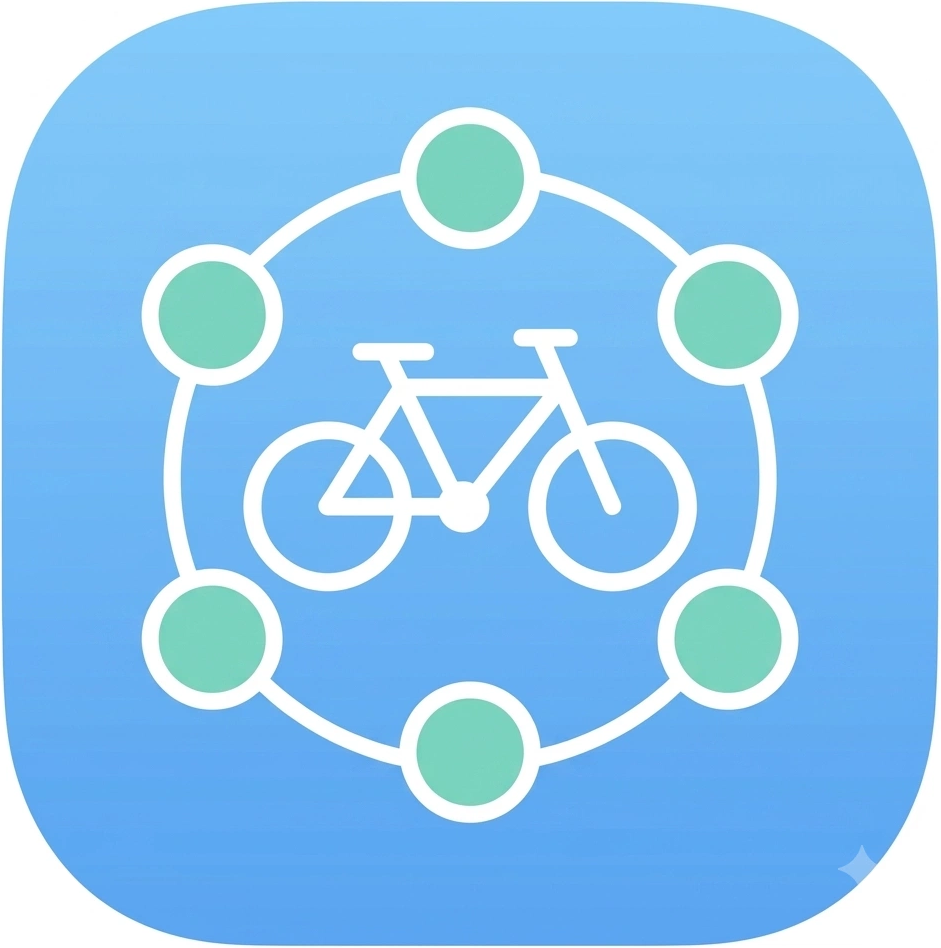
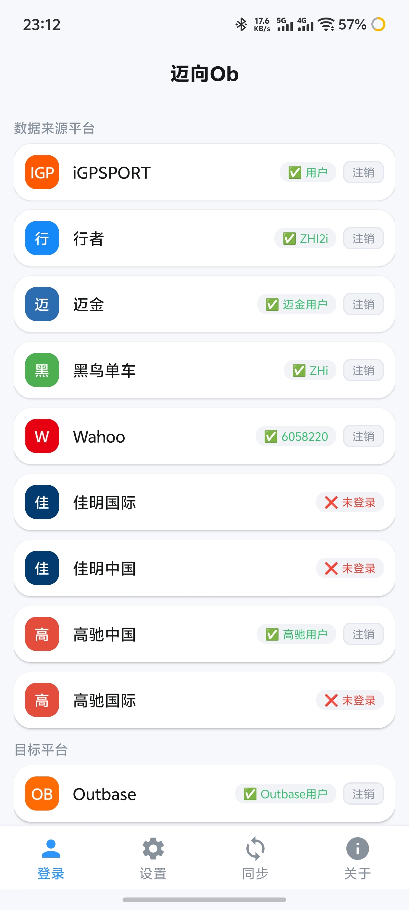
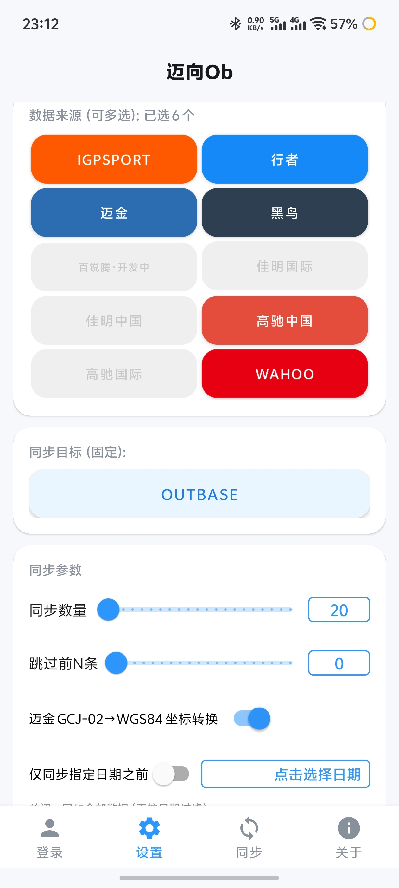
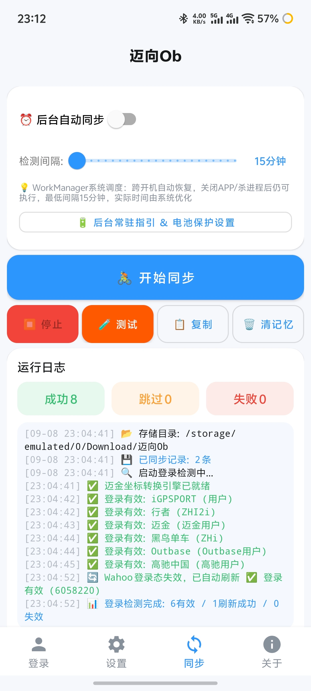
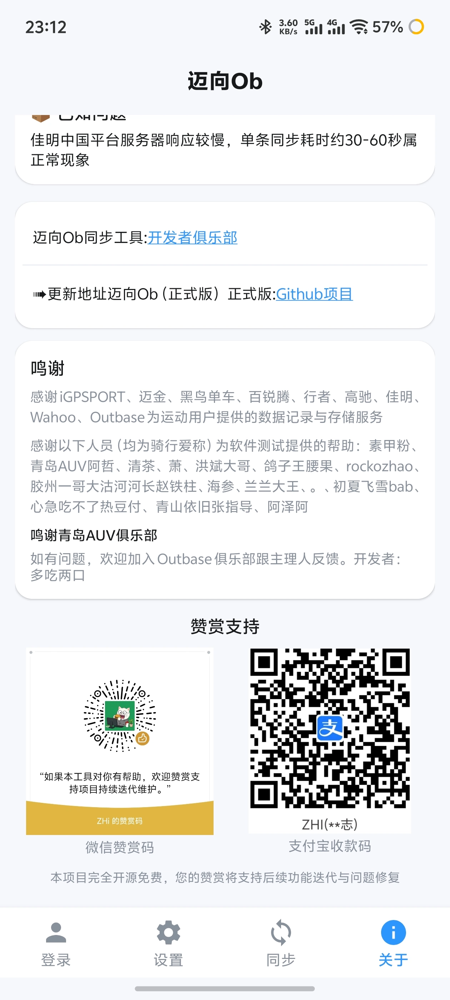

# 🚴 迈向Ob（正式版）

<p align="center"></p>

**多平台运动数据 → Outbase 一键迁移工具**

[](https://developer.android.com)
[](https://kotlinlang.org)
[](LICENSE)
[]()

一款 Android 运动数据迁移工具：**一次勾选多个数据源平台，统一批量上传到 Outbase**，解决骑行/跑步数据散落在多个平台、难以集中管理的痛点。

让运动数据自由流动 🚴♂️

> **正式版**：专注「多来源 → Outbase」单向链路，主打稳定，适合日常使用。
>
> **开发体验版**：支持平台间互传等更多新功能，目前正处于开放测试阶段，功能可能还不够稳定，还请大家多多担待。欢迎体验：[开发体验版](https://github.com/Anathleticbicyclist/sports-data-sync-multiplatform)

---

## ✨ 功能特性

### 核心功能（多对一 Outbase 上传）

- 🎯 **多对一上传** — 一次勾选多个数据来源平台，统一上传到 Outbase，每条记录自动去重
- ✅ **批量同步** — 支持 1~1000 条记录，可跳过前 N 条历史数据
- 🔄 **后台自动同步** — WorkManager 调度，系统级保活，跨开机自动恢复，可配置检测间隔
- 📋 **详细运行日志** — 全程记录，一键复制，失败原因分类
- 💾 **同步记忆** — 已上传记录自动记忆，不重复上传；支持"忽略记忆，强制重传"
- 📅 **仅同步指定日期之前** — 开启后只同步截止日期之前的历史数据，适合回溯旧记录
- 📂 **文件本地存储** — 同步的 FIT/GPX 文件自动保存至手机 `Download/迈向Ob/` 目录
- 🧭 **迈金 GCJ-02 坐标转换** — 迈金 fit_content 通道自动修正坐标偏移
- ⏰ **开屏动画** — 1 秒清爽开屏，浅蓝渐变

### 四页布局

| 页面 | 说明 |
|:----|:----|
| **登录** | 各平台登录卡片，独立登录互不影响，支持注销 |
| **设置** | 多选数据来源、同步数量、跳过前 N 条、仅同步指定日期之前、迈金坐标转换、忽略记忆开关 |
| **同步** | 开始/停止/测试下载、一键复制日志、清除同步记忆、后台自动同步开关 |
| **关于** | 版本信息、更新日志、鸣谢、赞赏支持、俱乐部与仓库链接 |

### 📱 界面预览

<p align="center">
  
  
  
  
</p>

---

## 🌐 支持平台

### 数据来源（可多选，下载数据）

| 平台 | 登录方式 | 数据格式 |
|:----|:--------|:--------|
| **iGPSPORT** | WebView 登录 | FIT |
| **行者** | WebView 登录 | GPX / FIT |
| **迈金/顽鹿OTM** | WebView 登录 | FIT |
| **黑鸟单车** | WebView 登录 | FIT |
| **百锐腾** | WebView 登录 | FIT / GPX（开发中） |
| **佳明国际** | WebView 登录 | FIT |
| **佳明中国** | WebView 登录 | FIT |
| **高驰中国** | WebView 登录 | FIT |
| **高驰国际** | WebView 登录 | FIT |
| **Wahoo** | OAuth2 登录 | FIT |

### 同步目标（固定）

| 平台 | 说明 |
|:----|:----|
| **Outbase** | 所有来源数据统一上传至 Outbase |

---

## 🚀 快速开始

1. **下载安装** — 从 [GitHub Releases](https://github.com/Anathleticbicyclist/sync-igpsport-magene-onelap-xingzhe-data-to-outbase/releases) 下载最新 APK 安装到 Android 设备
2. **登录数据源** — 登录页点击各平台卡片完成登录（需账号的平台按平台登录方式操作）
3. **登录 Outbase** — 登录页点击 Outbase 卡片完成登录
4. **选择数据来源** — 设置页多选要同步的数据源（已登录才可选）
5. **设置同步参数** — 调整同步数量、跳过前 N 条、坐标转换开关等
6. **开始同步** — 同步页点击「开始同步」，统一上传到 Outbase
7. **后台自动同步**（可选）— 开启自动同步并设置检测间隔，按指引完成后台保活设置

---

## ⚠️ 已知问题

| 问题 | 影响范围 | 说明 | 状态 |
|:----|:--------|:----|:----|
| **佳明中国服务器慢** | 佳明中国作为来源 | 佳明中国服务器端响应慢，单条下载/上传约 30~60 秒属正常现象 | 服务器端限制，功能正常 |
| **百锐腾下载开发中** | 百锐腾作为来源 | 百锐腾下载功能开发中，同步时会自动跳过 | 开发中 |

---

## 🛠️ 技术栈

- **语言**: Kotlin 2.2.0
- **最低 SDK**: Android 8.0 (API 26)
- **目标 SDK**: Android 16 (API 36)
- **构建工具**: Gradle 8.13 + AGP 8.13.0
- **网络**: OkHttp 4.12
- **协程**: Kotlinx Coroutines 1.7.3
- **后台任务**: WorkManager
- **UI**: Material Components

---

## 📁 项目结构

```
app/
├── build.gradle                  # 应用模块配置
└── src/main/
    ├── AndroidManifest.xml
    ├── assets/
    │   ├── bridge.html           # WebView 桥页面（GPX转FIT）
    │   ├── gpx2fit.js            # Outbase官方 GPX→FIT 转换库
    │   └── magene_fix.js         # 迈金 GCJ-02→WGS84 坐标修正
    ├── java/com/jichi/ob/
    │   ├── MainActivity.kt       # 主界面 + 多对一同步调度
    │   ├── SplashActivity.kt     # 1秒开屏动画
    │   ├── AutoSyncWorker.kt     # 后台自动同步（WorkManager）
    │   ├── api/                  # 各平台接口（下载）+ Outbase上传
    │   ├── ui/
    │   │   ├── LoginFragment.kt        # 页面1 登录
    │   │   ├── SyncSettingsFragment.kt # 页面2 设置
    │   │   ├── SyncFragment.kt         # 页面3 同步
    │   │   ├── AboutFragment.kt        # 页面4 关于
    │   │   └── LoginWebActivity.kt     # WebView 登录
    │   ├── model/Activity.kt     # 数据模型 + 平台能力声明
    │   └── util/                 # 凭证存储、日志、文件保存
    └── res/                      # 布局、配色、字符串、图标、赞赏码
```

---

## 🔧 构建（开发者）

### 环境要求

- **JDK 17**（完整JDK，含javac）
- **Android SDK**: platforms;android-36 + build-tools
- **Gradle 8.13**（项目自带 gradle wrapper）

### 构建步骤

```bash
# 1. 克隆仓库
git clone https://github.com/Anathleticbicyclist/sync-igpsport-magene-onelap-xingzhe-data-to-outbase.git
cd sync-igpsport-magene-onelap-xingzhe-data-to-outbase

# 2. 配置签名密钥 local.properties（不提交到 git）
# storeFile=../jichi-ob-dev.keystore
# storePassword=你的密钥库口令
# keyAlias=jichiobdev
# keyPassword=你的密钥口令

# 3. 构建
./gradlew assembleRelease

# 4. 产物位置
# app/build/outputs/apk/release/app-release.apk
```

### 注意事项

- ⚠️ 工程需放在**本地磁盘**编译，网络挂载文件系统（如 OSS/FUSE）不支持 Gradle 校验服务
- ⚠️ 首次构建需要下载依赖，已内置阿里云镜像（settings.gradle）
- ⚠️ `local.properties` 与密钥库文件已加入 `.gitignore`，切勿提交到仓库

---

## 📋 更新日志

### v8.1.1（2026-09-09）

**已解决**
- 同步页与设置页全面改版：同步页四卡分区（后台同步 / 操作 / 统计 / 运行日志），设置页分组卡片（数据来源 / 同步目标 / 同步数量 / 数据处理 / 日期过滤 / 存储），界面更清爽易读
- 开始同步按钮新增同步进度动画：跑马灯呼吸推进，随同步完成逐渐填满
- 操作按钮改为 2×2 网格布局，文字完整显示不再截断
- 设置页说明文字加深加大，数据来源网格严格对齐，消除文字看不清问题

**未解决**
- 佳明中国服务器端响应慢（见已知问题）
- 百锐腾下载开发中

### v8.1.0（2026-09-08）

**已解决**
- UI 全面优化：清新淡蓝主色（#2E96FF）、扁平化风格、大圆角卡片与细腻阴影
- 登录页改为单列卡片：平台图标 + 状态徽标 + 点击卡片即可登录，移除百锐腾入口
- 设置页改为三段式卡片布局：数据来源（2 列网格）/ 同步目标 / 同步参数；来源平台全名区分（佳明/高驰 中国·国际）
- 运行日志重构为状态时间线：时间戳灰色 + 成功/失败/跳过按状态彩色分级
- 关于页排版美化：版本徽标、链接卡片、鸣谢卡片
- 更换全新应用图标（蓝底自行车 + 六色彩环，去白边）
- 百锐腾在界面与文档中标注「开发中」，避免误导
- 新增「仅同步指定日期之前」：开启后只同步截止日期之前的数据，可用于回溯历史数据（手动与自动同步均生效）
- 存储目录优化为「下载/迈向Ob」，旧版本已下载数据自动迁移、不丢失
- 后台自动同步更可靠：执行、完成、跳过、失败均有通知提醒，不再静默无感知

**未解决**
- 佳明中国服务器端响应慢（见已知问题）
- 百锐腾下载开发中

### v8.0.0（2026-09-08）

**已解决**
- 全新重构：从开发版移植四页布局（登录/设置/同步/关于）与 1 秒开屏动画
- 支持多对一 Outbase 上传：一次勾选多个数据源，统一上传到 Outbase
- 数据来源扩展至 10 个平台（新增黑鸟单车、佳明国际/中国、高驰中国/国际、Wahoo）
- 后台自动同步升级为 WorkManager 调度（跨开机恢复、系统级保活）

**未解决**
- 佳明中国服务器端响应慢（见已知问题）
- 百锐腾下载开发中

### v6.1.0（2026-08-18）

- 数据来源记忆 — 重启 APP 自动恢复上次选择的数据来源
- 文件本地存储 — 同步文件保存至手机 `Download/迈向Ob/` 目录
- 迈金 GCJ-02→WGS84 坐标转换开关
- 同步记忆 — 已同步记录本地记账，跳过上限提升至 10000
- 后台自动同步 — 开关 + 检测间隔 + 后台常驻指引

### v6.0.9

- 初始开源版本
- 多平台 WebView 登录 + 批量同步到 Outbase
- GPX→FIT 本地转换（行者专用）
- 迈金双通道下载（七牛直链 + fit_content）
- Outbase 多策略上传（CDN h5 + WebView 回退）

---

## 📄 数据版权声明

各平台数据版权归原平台和该数据产生用户共同所有，本工具仅用于用户个人数据的迁移与备份，不得用于商业用途或数据爬取。

---

## 📄 许可证

本项目采用 [MIT License](LICENSE) 开源。

---

## 🙏 鸣谢

感谢以下平台为热爱运动的用户提供的数据记录与存储服务：

- iGPSPORT 迹驰 — 专业骑行码表与运动数据平台 [www.igpsport.com](https://www.igpsport.com/)
- 行者 — 运动记录与骑行社区平台 [www.imxingzhe.com](https://www.imxingzhe.com/)
- 迈金/顽鹿 — 智能骑行设备与数据平台 [www.magene.com](https://www.magene.com/)
- 黑鸟单车 — 骑行运动记录平台 [www.blackbird.com.cn](http://www.blackbird.com.cn/)
- 百锐腾 — 骑行码表与运动数据平台 [www.brytonsport.com](https://www.brytonsport.com/)
- 佳明 — 智能运动手表与生态平台 [www.garmin.com](https://www.garmin.com/)
- 高驰 — 户外运动手表与数据平台 [www.coros.com](https://www.coros.com/)
- Wahoo — 智能骑行设备与训练平台 [www.wahoofitness.com](https://www.wahoofitness.com/)
- Outbase — 运动数据聚合平台 [outbase.cn](https://outbase.cn/)

感谢以下人员（均为骑行爱称）为软件测试提供的帮助：素甲粉、青岛AUV阿哲、清茶、萧、洪斌大哥、鸽子王腰果、rockozhao、胶州一哥大沽河河长赵铁柱、海参、兰兰大王、。。、初夏飞雪bab、心急吃不了热豆付、青山依旧张指导、阿泽阿

鸣谢青岛AUV俱乐部

感谢开源项目 [garth](https://github.com/matinaslight/garth)、[magene-fit-strava-fix](https://github.com/dwmer0308-a11y/magene-fit-strava-fix) 提供的佳明登录与迈金坐标修正算法参考。

---

## 📞 联系我们

如有问题或建议，欢迎加入 [Outbase 俱乐部](https://outbase.cn/zeusfit/zeusfit-mk/sharePage.html?_bid=1005477&type=club&clubId=MTAxMjgz&timestamp=1787569599904&sign=b4604ad9041551e64ce90ea385a0029f) 与主理人反馈。

**迈向Ob** — 让运动数据自由流动 🚴♂️
